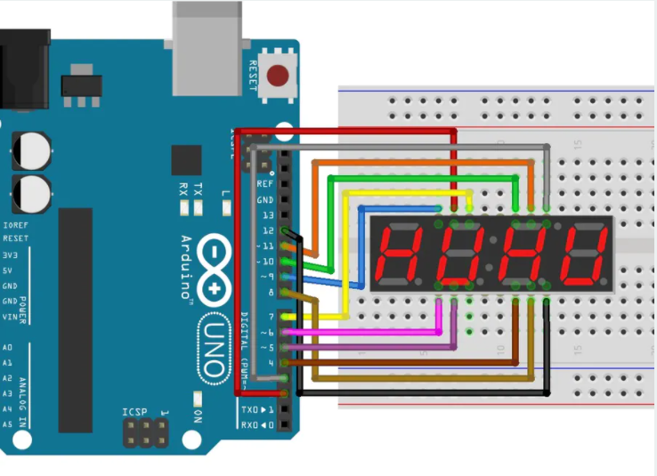

# Basketball_Hoop

## Planning

https://docs.google.com/document/d/1XMKTJJ2iJljxaTinYw4Xjde5B8b4VCf9x-aKtkw4NvU/edit

## Materials

7 segment display 1.2'- https://www.adafruit.com/product/1269

Basketball hoop 12x18 - https://sklz.implus.com/products/pro-mini-hoop/sklz-pro-mini-hoop-original

## Milestones

### Week 1

This is a link to our planning - https://docs.google.com/document/d/1XMKTJJ2iJljxaTinYw4Xjde5B8b4VCf9x-aKtkw4NvU/edit

In week one we wrte a little bit of pseudo code and figured out what materials we will need.

```C++ 
#define echoPin 2 // attach pin D2 Arduino to pin Echo of HC-SR04
#define trigPin 3 //attach pin D3 Arduino to pin Trig of HC-SR04

long duration; // variable for the duration of sound wave travel
int distance; // variable for the distance measurement
int pos = 0;
int dis = 0;

void setup() {
  pinMode(trigPin, OUTPUT); // Sets the trigPin as an OUTPUT
  pinMode(echoPin, INPUT); // Sets the echoPin as an INPUT
  Serial.begin(9600); // // Serial Communication is starting with 9600 of baudrate speed
  Serial.println("Ultrasonic Sensor HC-SR04 Test"); // print some text in Serial Monitor
  Serial.println("with Arduino UNO R3");  
}

void loop() {
  
}

int getdistance() {
  // Clears the trigPin condition
  digitalWrite(trigPin, LOW);
  delayMicroseconds(2);
  // Sets the trigPin HIGH (ACTIVE) for 10 microseconds
  digitalWrite(trigPin, HIGH);
  delayMicroseconds(2);
  digitalWrite(trigPin, LOW);
  // Reads the echoPin, returns the sound wave travel time in microseconds
  duration = pulseIn(echoPin, HIGH);
  // Calculating the distance
  distance = duration * 0.034 / 2; // Speed of sound wave divided by 2 (go and back)
  // Displays the distance on the Serial Monitor
  Serial.print("Distance: ");
  Serial.print(distance);
  Serial.println(" cm");
  return distance;
}

```

That code is just the get distance function so next week we will need to make/find code for our display as well as order the materials.

### Week 2

```C+++


void loop() {

}

int getdistance() {
  // Clears the trigPin condition
  digitalWrite(trigPin, LOW);
  delayMicroseconds(2);
  // Sets the trigPin HIGH (ACTIVE) for 10 microseconds
  digitalWrite(trigPin, HIGH);
  delayMicroseconds(2);
  digitalWrite(trigPin, LOW);
  // Reads the echoPin, returns the sound wave travel time in microseconds
  duration = pulseIn(echoPin, HIGH);
  // Calculating the distance
  distance = duration * 0.034 / 2; // Speed of sound wave divided by 2 (go and back)
  // Displays the distance on the Serial Monitor
  Serial.print("Distance: ");
  Serial.print(distance);
  Serial.println(" cm");
  return distance;
}


// the loop routine runs over and over again forever:
void loop() {

  // THIS MOVES BELOW CODE TO THE NEXT LCD BLOCK
  digitalWrite(D1, HIGH);
  digitalWrite(D2, LOW);
  digitalWrite(D3, LOW);
  digitalWrite(D4, LOW);
  //THIS ENDS THE MOVEMENT AND REMAINS ON THE LAST BLOCK FOR THE FOLLOWING DIGITS

  //0
  digitalWrite(pinA, LOW);
  digitalWrite(pinB, LOW);
  digitalWrite(pinC, LOW);
  digitalWrite(pinD, LOW);
  digitalWrite(pinE, LOW);
  digitalWrite(pinF, LOW);
  digitalWrite(pinG, HIGH);
  delay(1000); // wait for a second

  // THIS MOVES BELOW CODE TO THE NEXT LCD BLOCK
  digitalWrite(D1, LOW);
  digitalWrite(D2, HIGH);
  digitalWrite(D3, LOW);
  digitalWrite(D4, LOW);
  //THIS ENDS THE MOVEMENT AND REMAINS ON THE LAST BLOCK FOR THE FOLLOWING DIGITS

  //1
  digitalWrite(pinA, HIGH);
  digitalWrite(pinB, LOW);
  digitalWrite(pinC, LOW);
  digitalWrite(pinD, HIGH);
  digitalWrite(pinE, HIGH);
  digitalWrite(pinF, HIGH);
  digitalWrite(pinG, HIGH);
  delay(1000); // wait for a second

  // THIS MOVES BELOW CODE TO THE NEXT LCD BLOCK
  digitalWrite(D1, LOW);
  digitalWrite(D2, LOW);
  digitalWrite(D3, HIGH);
  digitalWrite(D4, LOW);
  //THIS ENDS THE MOVEMENT AND REMAINS ON THE LAST BLOCK FOR THE FOLLOWING DIGITS
  
```
The code above is a segment of a code I found on arduino project hub that counts up 1 through 9 on the 7 segment display. It was written by sAnwandter1.
The digital writes tell which led to lightup to display the given numbers.

### Week 3 

```C+++
#define echoPin 2 // attach pin D2 Arduino to pin Echo of HC-SR04
#define trigPin 3 //attach pin D3 Arduino to pin Trig of HC-SR04

long duration; // variable for the duration of sound wave travel
int distance; // variable for the distance measurement
int pos = 0;
int dis = 0;
int pinA = 2;
int pinB = 3;
int pinC = 4;
int pinD = 5;
int pinE = 6;
int pinF = 7;
int pinG = 8;
int D1 = 9;
int D2 = 10;
int D3 = 11;
int D4 = 12;  // Pin 2-8 is connected to the 7 segments of the display.
int counter = 0;
int dist = 0;


void setup() {
  pinMode(trigPin, OUTPUT); // Sets the trigPin as an OUTPUT
  pinMode(echoPin, INPUT); // Sets the echoPin as an INPUT
  Serial.begin(9600); // // Serial Communication is starting with 9600 of baudrate speed
  Serial.println("Ultrasonic Sensor HC-SR04 Test"); // print some text in Serial Monitor
  Serial.println("with Arduino UNO R3");
  pinMode(pinA, OUTPUT);
  pinMode(pinB, OUTPUT);
  pinMode(pinC, OUTPUT);
  pinMode(pinD, OUTPUT);
  pinMode(pinE, OUTPUT);
  pinMode(pinF, OUTPUT);
  pinMode(pinG, OUTPUT);
  pinMode(D1, OUTPUT);
  pinMode(D2, OUTPUT);
  pinMode(D3, OUTPUT);
  pinMode(D4, OUTPUT);
}


int getdistance() {
  // Clears the trigPin condition
  digitalWrite(trigPin, LOW);
  delayMicroseconds(2);
  // Sets the trigPin HIGH (ACTIVE) for 10 microseconds
  digitalWrite(trigPin, HIGH);
  delayMicroseconds(2);
  digitalWrite(trigPin, LOW);
  // Reads the echoPin, returns the sound wave travel time in microseconds
  duration = pulseIn(echoPin, HIGH);
  // Calculating the distance
  distance = duration * 0.034 / 2; // Speed of sound wave divided by 2 (go and back)
  // Displays the distance on the Serial Monitor
  Serial.print("Distance: ");
  Serial.print(distance);
  Serial.println(" cm");
  return distance;
}


// the loop routine runs over and over again forever:
void loop() {
  dist = getdistance();
  if (dist < 5) {
    Serial.print("Counter: ");
    Serial.print(counter);
    counter ++ ;
  }
  else if (counter == 0) {
    Display_0() ;
  }
  else if (counter == 1) {
  Display_1() ;  
  }
  else if (counter == 2) {
  Display_2() ;
  }
  else if (counter == 3) {
  Display_3() ;  
  }
  else if (counter == 4) {
  Display_4() ;   
  }
  else if (counter == 5) {
  Display_5() ;  
  }
  else if (counter == 6) {
  Display_6() ;
  }
  else if (counter == 7) {
  Display_7() ;  
  }
  else if (counter == 8) {
  Display_8() ;  
  }
  else if (counter == 9) {
  Display_9();  
  }
}

void Display_0() {
  //0
  digitalWrite(pinA, LOW);
  digitalWrite(pinB, LOW);
  digitalWrite(pinC, LOW);
  digitalWrite(pinD, LOW);
  digitalWrite(pinE, LOW);
  digitalWrite(pinF, LOW);
  digitalWrite(pinG, HIGH);
  delay(1000); // wait for a second
}


void Display_1() {
  //1
  digitalWrite(pinA, HIGH);
  digitalWrite(pinB, LOW);
  digitalWrite(pinC, LOW);
  digitalWrite(pinD, HIGH);
  digitalWrite(pinE, HIGH);
  digitalWrite(pinF, HIGH);
  digitalWrite(pinG, HIGH);
  delay(1000); // wait for a second
}


void Display_2() {
  //2
  digitalWrite(pinA, LOW);
  digitalWrite(pinB, LOW);
  digitalWrite(pinC, HIGH);
  digitalWrite(pinD, LOW);
  digitalWrite(pinE, LOW);
  digitalWrite(pinF, HIGH);
  digitalWrite(pinG, LOW);
  delay(1000); // wait for a second
}

void Display_3() {
  //3
  digitalWrite(pinA, LOW);
  digitalWrite(pinB, LOW);
  digitalWrite(pinC, LOW);
  digitalWrite(pinD, LOW);
  digitalWrite(pinE, HIGH);
  digitalWrite(pinF, HIGH);
  digitalWrite(pinG, LOW);
  delay(1000); // wait for a second
}


void Display_4() {
  //4
  digitalWrite(pinA, HIGH);
  digitalWrite(pinB, LOW);
  digitalWrite(pinC, LOW);
  digitalWrite(pinD, HIGH);
  digitalWrite(pinE, HIGH);
  digitalWrite(pinF, LOW);
  digitalWrite(pinG, LOW);
  delay(1000); // wait for a second
}


void Display_5() {
  //5
  digitalWrite(pinA, LOW);
  digitalWrite(pinB, HIGH);
  digitalWrite(pinC, LOW);
  digitalWrite(pinD, LOW);
  digitalWrite(pinE, HIGH);
  digitalWrite(pinF, LOW);
  digitalWrite(pinG, LOW);
  delay(1000); // wait for a second
}

void Display_6() {
  //6
  digitalWrite(pinA, LOW);
  digitalWrite(pinB, HIGH);
  digitalWrite(pinC, LOW);
  digitalWrite(pinD, LOW);
  digitalWrite(pinE, LOW);
  digitalWrite(pinF, LOW);
  digitalWrite(pinG, LOW);
  delay(1000); // wait for a second
}


void Display_7() {
  //7
  digitalWrite(pinA, LOW);
  digitalWrite(pinB, LOW);
  digitalWrite(pinC, LOW);
  digitalWrite(pinD, HIGH);
  digitalWrite(pinE, HIGH);
  digitalWrite(pinF, HIGH);
  digitalWrite(pinG, HIGH);
  delay(1000); // wait for a second
}


void Display_8() {
  //8
  digitalWrite(pinA, LOW);
  digitalWrite(pinB, LOW);
  digitalWrite(pinC, LOW);
  digitalWrite(pinD, LOW);
  digitalWrite(pinE, LOW);
  digitalWrite(pinF, LOW);
  digitalWrite(pinG, LOW);
  delay(1000); // wait for a second
}


void Display_9() {
  //9
  digitalWrite(pinA, LOW);
  digitalWrite(pinB, LOW);
  digitalWrite(pinC, LOW);
  digitalWrite(pinD, HIGH);
  digitalWrite(pinE, HIGH);
  digitalWrite(pinF, LOW);
  digitalWrite(pinG, LOW);
  delay(1000); // wait for a second
}
```
This is the final code. I made a seperate function for each number that was displayed. I then made a counter and set it so everytime the ultrasonic sensor was triggered it would count up on the counter. I then set it so whatever the counter was at it would play the corresponding numbers function.   

### Week 4

## Diagram of Wiring

### Ultrasonic sensor

### 7 segment diplay 



### Final wiring

## Final Code

```C+++
#define echoPin 2 // attach pin D2 Arduino to pin Echo of HC-SR04
#define trigPin 3 //attach pin D3 Arduino to pin Trig of HC-SR04

long duration; // variable for the duration of sound wave travel
int distance; // variable for the distance measurement
int pos = 0;
int dis = 0;
int pinA = 2;
int pinB = 3;
int pinC = 4;
int pinD = 5;
int pinE = 6;
int pinF = 7;
int pinG = 8;
int D1 = 9;
int D2 = 10;
int D3 = 11;
int D4 = 12;  // Pin 2-8 is connected to the 7 segments of the display.
int counter = 0;
int dist = 0;


void setup() {
  pinMode(trigPin, OUTPUT); // Sets the trigPin as an OUTPUT
  pinMode(echoPin, INPUT); // Sets the echoPin as an INPUT
  Serial.begin(9600); // // Serial Communication is starting with 9600 of baudrate speed
  Serial.println("Ultrasonic Sensor HC-SR04 Test"); // print some text in Serial Monitor
  Serial.println("with Arduino UNO R3");
  pinMode(pinA, OUTPUT);
  pinMode(pinB, OUTPUT);
  pinMode(pinC, OUTPUT);
  pinMode(pinD, OUTPUT);
  pinMode(pinE, OUTPUT);
  pinMode(pinF, OUTPUT);
  pinMode(pinG, OUTPUT);
  pinMode(D1, OUTPUT);
  pinMode(D2, OUTPUT);
  pinMode(D3, OUTPUT);
  pinMode(D4, OUTPUT);
}


int getdistance() {
  // Clears the trigPin condition
  digitalWrite(trigPin, LOW);
  delayMicroseconds(2);
  // Sets the trigPin HIGH (ACTIVE) for 10 microseconds
  digitalWrite(trigPin, HIGH);
  delayMicroseconds(2);
  digitalWrite(trigPin, LOW);
  // Reads the echoPin, returns the sound wave travel time in microseconds
  duration = pulseIn(echoPin, HIGH);
  // Calculating the distance
  distance = duration * 0.034 / 2; // Speed of sound wave divided by 2 (go and back)
  // Displays the distance on the Serial Monitor
  Serial.print("Distance: ");
  Serial.print(distance);
  Serial.println(" cm");
  return distance;
}


// the loop routine runs over and over again forever:
void loop() {
  dist = getdistance();
  if (dist < 5) {
    Serial.print("Counter: ");
    Serial.print(counter);
    counter ++ ;
  }
  else if (counter == 0) {
    Display_0() ;
  }
  else if (counter == 1) {
  Display_1() ;  
  }
  else if (counter == 2) {
  Display_2() ;
  }
  else if (counter == 3) {
  Display_3() ;  
  }
  else if (counter == 4) {
  Display_4() ;   
  }
  else if (counter == 5) {
  Display_5() ;  
  }
  else if (counter == 6) {
  Display_6() ;
  }
  else if (counter == 7) {
  Display_7() ;  
  }
  else if (counter == 8) {
  Display_8() ;  
  }
  else if (counter == 9) {
  Display_9();  
  }
}

void Display_0() {
  //0
  digitalWrite(pinA, LOW);
  digitalWrite(pinB, LOW);
  digitalWrite(pinC, LOW);
  digitalWrite(pinD, LOW);
  digitalWrite(pinE, LOW);
  digitalWrite(pinF, LOW);
  digitalWrite(pinG, HIGH);
  delay(1000); // wait for a second
}


void Display_1() {
  //1
  digitalWrite(pinA, HIGH);
  digitalWrite(pinB, LOW);
  digitalWrite(pinC, LOW);
  digitalWrite(pinD, HIGH);
  digitalWrite(pinE, HIGH);
  digitalWrite(pinF, HIGH);
  digitalWrite(pinG, HIGH);
  delay(1000); // wait for a second
}


void Display_2() {
  //2
  digitalWrite(pinA, LOW);
  digitalWrite(pinB, LOW);
  digitalWrite(pinC, HIGH);
  digitalWrite(pinD, LOW);
  digitalWrite(pinE, LOW);
  digitalWrite(pinF, HIGH);
  digitalWrite(pinG, LOW);
  delay(1000); // wait for a second
}

void Display_3() {
  //3
  digitalWrite(pinA, LOW);
  digitalWrite(pinB, LOW);
  digitalWrite(pinC, LOW);
  digitalWrite(pinD, LOW);
  digitalWrite(pinE, HIGH);
  digitalWrite(pinF, HIGH);
  digitalWrite(pinG, LOW);
  delay(1000); // wait for a second
}


void Display_4() {
  //4
  digitalWrite(pinA, HIGH);
  digitalWrite(pinB, LOW);
  digitalWrite(pinC, LOW);
  digitalWrite(pinD, HIGH);
  digitalWrite(pinE, HIGH);
  digitalWrite(pinF, LOW);
  digitalWrite(pinG, LOW);
  delay(1000); // wait for a second
}


void Display_5() {
  //5
  digitalWrite(pinA, LOW);
  digitalWrite(pinB, HIGH);
  digitalWrite(pinC, LOW);
  digitalWrite(pinD, LOW);
  digitalWrite(pinE, HIGH);
  digitalWrite(pinF, LOW);
  digitalWrite(pinG, LOW);
  delay(1000); // wait for a second
}

void Display_6() {
  //6
  digitalWrite(pinA, LOW);
  digitalWrite(pinB, HIGH);
  digitalWrite(pinC, LOW);
  digitalWrite(pinD, LOW);
  digitalWrite(pinE, LOW);
  digitalWrite(pinF, LOW);
  digitalWrite(pinG, LOW);
  delay(1000); // wait for a second
}


void Display_7() {
  //7
  digitalWrite(pinA, LOW);
  digitalWrite(pinB, LOW);
  digitalWrite(pinC, LOW);
  digitalWrite(pinD, HIGH);
  digitalWrite(pinE, HIGH);
  digitalWrite(pinF, HIGH);
  digitalWrite(pinG, HIGH);
  delay(1000); // wait for a second
}


void Display_8() {
  //8
  digitalWrite(pinA, LOW);
  digitalWrite(pinB, LOW);
  digitalWrite(pinC, LOW);
  digitalWrite(pinD, LOW);
  digitalWrite(pinE, LOW);
  digitalWrite(pinF, LOW);
  digitalWrite(pinG, LOW);
  delay(1000); // wait for a second
}


void Display_9() {
  //9
  digitalWrite(pinA, LOW);
  digitalWrite(pinB, LOW);
  digitalWrite(pinC, LOW);
  digitalWrite(pinD, HIGH);
  digitalWrite(pinE, HIGH);
  digitalWrite(pinF, LOW);
  digitalWrite(pinG, LOW);
  delay(1000); // wait for a second
}
```

## Errors and How We Overcame Them
