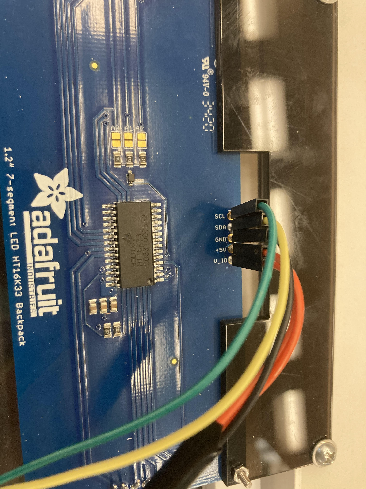
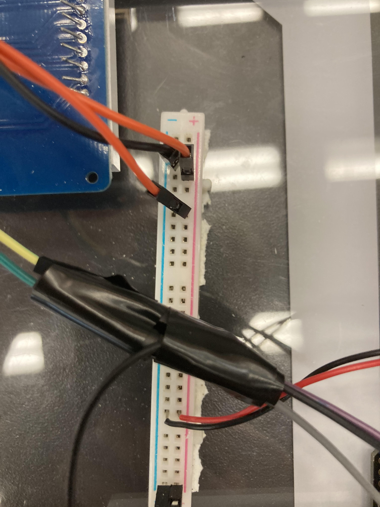
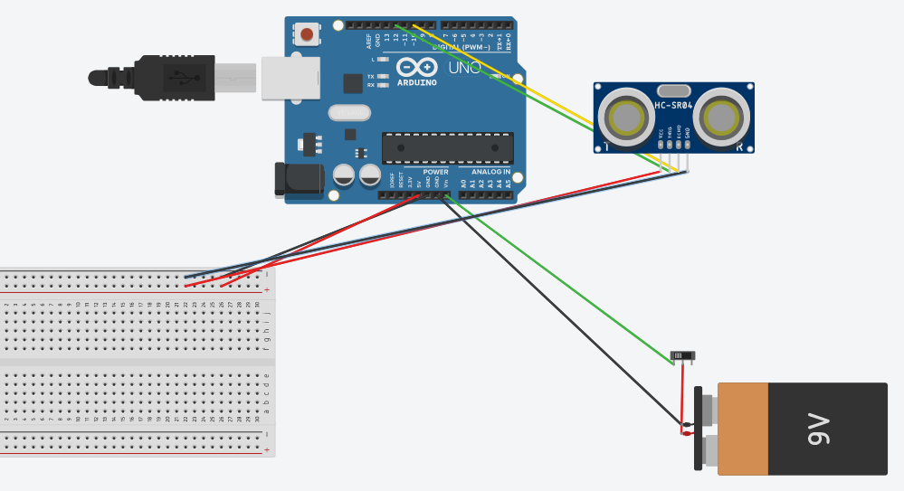
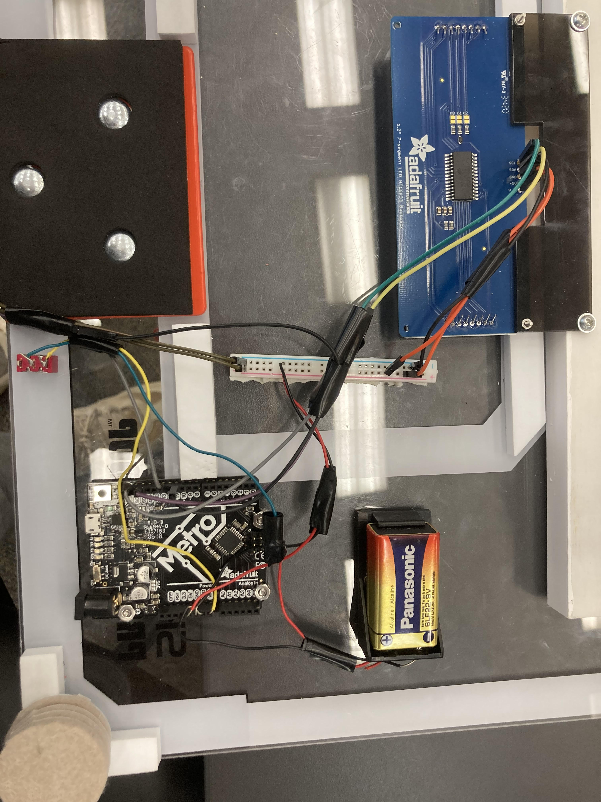
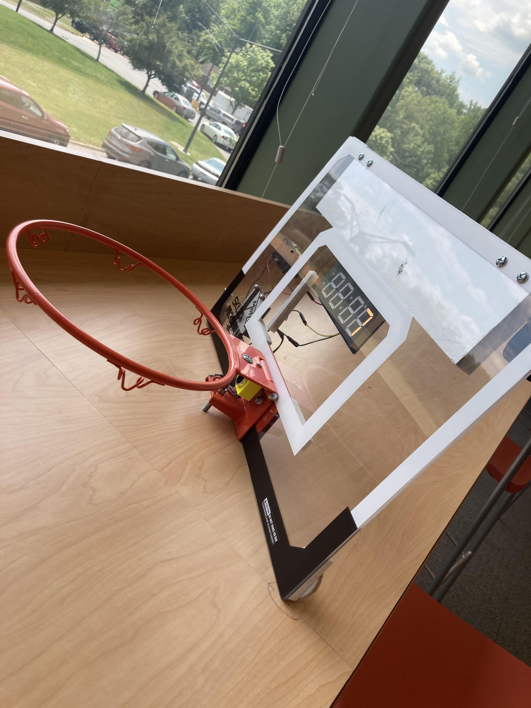
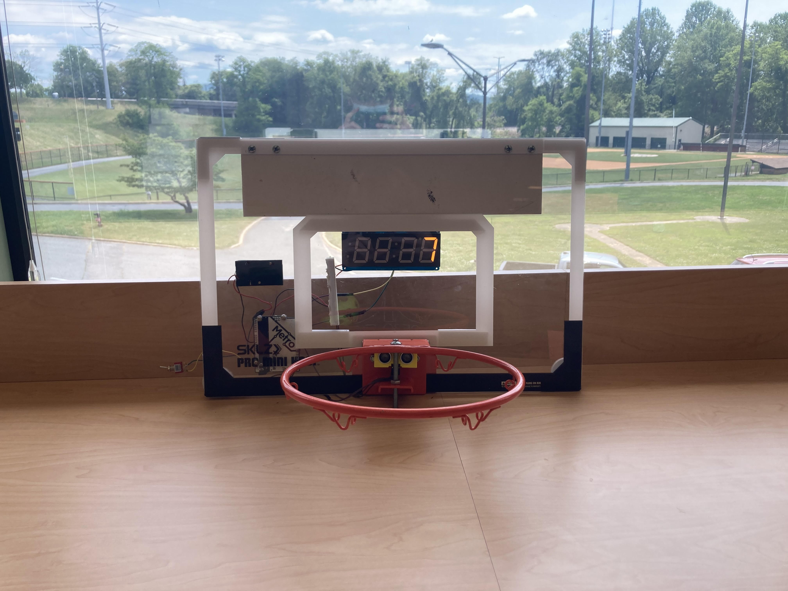
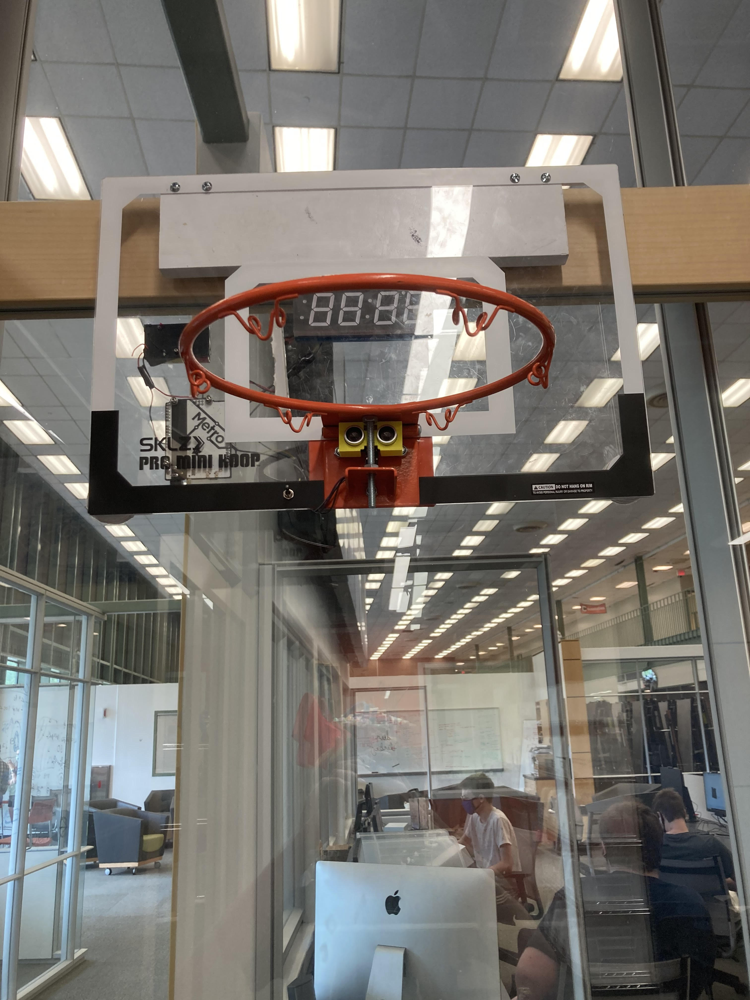

# Basketball_Hoop

## What major obstacle has kept us from making better progress?

Whats held us back from making a lot of progress is the amount of resources available because we have needed something that will essentially finish our project that we need our parents to help us make. 

## Planning

https://docs.google.com/document/d/1XMKTJJ2iJljxaTinYw4Xjde5B8b4VCf9x-aKtkw4NvU/edit

## Materials

7 segment display 50mm/2" wide 120mm/4.7" long 13mm/0.5" high- https://www.adafruit.com/product/1269

Basketball hoop 12x18 - https://sklz.implus.com/products/pro-mini-hoop/sklz-pro-mini-hoop-original

## Milestones

### Week 1

This is a link to our planning - https://docs.google.com/document/d/1XMKTJJ2iJljxaTinYw4Xjde5B8b4VCf9x-aKtkw4NvU/edit

In week one we wrte a little bit of pseudo code and figured out what materials we will need.

```C++ 
#define echoPin 2 // attach pin D2 Arduino to pin Echo of HC-SR04
#define trigPin 3 //attach pin D3 Arduino to pin Trig of HC-SR04

long duration; // variable for the duration of sound wave travel
int distance; // variable for the distance measurement
int pos = 0;
int dis = 0;

void setup() {
  pinMode(trigPin, OUTPUT); // Sets the trigPin as an OUTPUT
  pinMode(echoPin, INPUT); // Sets the echoPin as an INPUT
  Serial.begin(9600); // // Serial Communication is starting with 9600 of baudrate speed
  Serial.println("Ultrasonic Sensor HC-SR04 Test"); // print some text in Serial Monitor
  Serial.println("with Arduino UNO R3");  
}

void loop() {
  
}

int getdistance() {
  // Clears the trigPin condition
  digitalWrite(trigPin, LOW);
  delayMicroseconds(2);
  // Sets the trigPin HIGH (ACTIVE) for 10 microseconds
  digitalWrite(trigPin, HIGH);
  delayMicroseconds(2);
  digitalWrite(trigPin, LOW);
  // Reads the echoPin, returns the sound wave travel time in microseconds
  duration = pulseIn(echoPin, HIGH);
  // Calculating the distance
  distance = duration * 0.034 / 2; // Speed of sound wave divided by 2 (go and back)
  // Displays the distance on the Serial Monitor
  Serial.print("Distance: ");
  Serial.print(distance);
  Serial.println(" cm");
  return distance;
}

```

That code is just the get distance function so next week we will need to make/find code for our display as well as order the materials.

### Week 2

```C++
// NewPing - Version: Latest
#include <NewPing.h>

#define TRIGGER_PIN 12 // Arduino pin tied to trigger pin on the ultrasonic sensor.
#define ECHO_PIN 11 // Arduino pin tied to echo pin on the ultrasonic sensor. 
#define MAX_DISTANCE 200 // Maximum distance we want to ping for (in centimeters).

int distance; // variable for the distance measurement
int pos = 0;
int dis = 0; 
int counter = 0;


NewPing sonar(TRIGGER_PIN, ECHO_PIN, MAX_DISTANCE); // NewPing setup of pins and maximum distance.

void setup() {
  Serial.begin(9600); // // Serial Communication is starting with 9600 of baudrate speed
}


// the loop routine runs over and over again forever:
void loop() {
  distance = sonar.ping_cm();
  Serial.print("distance: ");
  Serial.print(distance);
  Serial.print("cm \t");

  if (distance < 5 && distance != 0) {
    counter++ ;
  }
  Serial.print("Counter: ");
  Serial.println(counter);
  
  if (counter == 0) {
  
  }
  else if (counter == 1) {
    
  }
  else if (counter == 2) {
    
  }
  else if (counter == 3) {
    
  }
  else if (counter == 4) {
  
  }
  else if (counter == 5) {
    
  }
  else if (counter == 6) {
    
  }
  else if (counter == 7) {
   
  }
  else if (counter == 8) {
   
  }
  else if (counter == 9) {
    
  }
}

```  

The code above is a counter where everytime the ultrasonic sensor is triggered it counts up on the counter. I am currently working on make the counter number be displayed on the 7 segemnt display.

### Week 3 

```C+
// NewPing - Version: Latest
#include <NewPing.h>
#include <Wire.h> // Enable this line if using Arduino Uno, Mega, etc.
#include <Adafruit_GFX.h>
#include "Adafruit_LEDBackpack.h"

Adafruit_7segment matrix = Adafruit_7segment();
/*

*/
#define TRIGGER_PIN 12 // Arduino pin tied to trigger pin on the ultrasonic sensor.
#define ECHO_PIN 11 // Arduino pin tied to echo pin on the ultrasonic sensor. 
#define MAX_DISTANCE 200 // Maximum distance we want to ping for (in centimeters).

int distance; // variable for the distance measurement
int pos = 0;
int dis = 0; 
int counter = 0;


NewPing sonar(TRIGGER_PIN, ECHO_PIN, MAX_DISTANCE); // NewPing setup of pins and maximum distance.

void setup() {
  Serial.begin(9600); // // Serial Communication is starting with 9600 of baudrate speed
  #ifndef __AVR_ATtiny85__
  Serial.println("7 Segment Backpack Test");
#endif
  matrix.begin(0x70);
}


// the loop routine runs over and over again forever:
void loop() {
  distance = sonar.ping_cm();
  Serial.print("distance: ");
  Serial.print(distance);
  Serial.print("cm \t");

  if (distance < 5 && distance != 0) {
    counter++ ;
  }
  Serial.print("Counter: ");
  Serial.println(counter);
  
  if (counter == 0) {
  matrix.print(0, DEC);
  matrix.writeDisplay();
  delay(500);  
  }
  else if (counter == 1) {
  matrix.print(1, DEC);
  matrix.writeDisplay();
  delay(500);  
  }
  else if (counter == 2) {
  matrix.print(2, DEC);
  matrix.writeDisplay();
  delay(500);    
  }
  else if (counter == 3) {
  matrix.print(3, DEC);
  matrix.writeDisplay();
  delay(500);    
  }
  else if (counter == 4) {
  matrix.print(4, DEC);
  matrix.writeDisplay();
  delay(500);  
  }
  else if (counter == 5) {
  matrix.print(5, DEC);
  matrix.writeDisplay();
  delay(500);    
  }
  else if (counter == 6) {
  matrix.print(6, DEC);
  matrix.writeDisplay();
  delay(500);    
  }
  else if (counter == 7) {
  matrix.print(7, DEC);
  matrix.writeDisplay();
  delay(500);  
  }
  else if (counter == 8) {
  matrix.print(8, DEC);
  matrix.writeDisplay();
  delay(500);   
  }
  else if (counter == 9) {
  matrix.print(9, DEC);
  matrix.writeDisplay();
  delay(500);    
  }
}
```

This is the final code. I made a seperate function for each number that was displayed. I then made a counter and set it so everytime the ultrasonic sensor was triggered it would count up on the counter. I then set it so whatever the counter was at it would play the corresponding numbers function.   

### Week 4

CAD Goal - Finish CAD BAckboard and hoop design.

Code Goal - Simplify code

```C+
#include <NewPing.h>
#include <Wire.h> // Enable this line if using Arduino Uno, Mega, etc.
#include <Adafruit_GFX.h>
#include "Adafruit_LEDBackpack.h"

Adafruit_7segment matrix = Adafruit_7segment();
/*

*/
#define TRIGGER_PIN 12 // Arduino pin tied to trigger pin on the ultrasonic sensor.
#define ECHO_PIN 11 // Arduino pin tied to echo pin on the ultrasonic sensor. 
#define MAX_DISTANCE 200 // Maximum distance we want to ping for (in centimeters).

int distance; // variable for the distance measurement
int pos = 0;
int dis = 0; 
int counter = 0;

NewPing sonar(TRIGGER_PIN, ECHO_PIN, MAX_DISTANCE); // NewPing setup of pins and maximum distance.

void setup() {
  Serial.begin(9600); // // Serial Communication is starting with 9600 of baudrate speed
  #ifndef __AVR_ATtiny85__
  Serial.println("7 Segment Backpack Test");
#endif
  matrix.begin(0x70);
}


// the loop routine runs over and over again forever:
void loop() {
  distance = sonar.ping_cm();
  Serial.print("distance: ");
  Serial.print(distance);
  Serial.print("cm \t");
  if (distance < 11 && distance != 0) {
    counter++ ;
  delay(20) ; 
  }
  Serial.print("Counter: ");
  Serial.println(counter);
  matrix.print(counter, DEC);
  matrix.writeDisplay();
  delay(20); 
 /* 
 ```
 The code here is simplifyed from having each individual number that we wanted to display printed out to the counter and display corresponding. 

## Diagram of Wiring

### 7 segment diplay 





### Final wiring






### Final code
```c+
#include <NewPing.h>
#include <Wire.h> // Enable this line if using Arduino Uno, Mega, etc.
#include <Adafruit_GFX.h>
#include "Adafruit_LEDBackpack.h"

Adafruit_7segment matrix = Adafruit_7segment();
/*

*/
#define TRIGGER_PIN 12 // Arduino pin tied to trigger pin on the ultrasonic sensor.
#define ECHO_PIN 11 // Arduino pin tied to echo pin on the ultrasonic sensor. 
#define MAX_DISTANCE 200 // Maximum distance we want to ping for (in centimeters).

int distance; // variable for the distance measurement
int pos = 0;
int dis = 0; 
int counter = 0;
int buzzerPin = 9;//buzzer to arduino pin 9


NewPing sonar(TRIGGER_PIN, ECHO_PIN, MAX_DISTANCE); // NewPing setup of pins and maximum distance.

void setup() {
  Serial.begin(9600); // // Serial Communication is starting with 9600 of baudrate speed
  #ifndef __AVR_ATtiny85__
  Serial.println("7 Segment Backpack Test");
#endif
  matrix.begin(0x70);
}


// the loop routine runs over and over again forever:
void loop() {
  distance = sonar.ping_cm();
  Serial.print("distance: ");
  Serial.print(distance);
  Serial.print("cm \t");
  if (distance < 11 && distance != 0) {
    counter++ ;
  delay(20) ; 
  }
  else if (counter == 15) { 
  digitalWrite(buzzerPin, HIGH);
  digitalWrite(buzzerPin, LOW);
  matrix.blinkRate(1); // blink code 
  }
  Serial.print("Counter: "); 
  Serial.println(counter);
  matrix.print(counter, DEC);
  matrix.writeDisplay();
  delay(20); 
```

### Final Product









